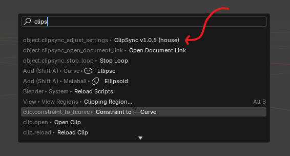
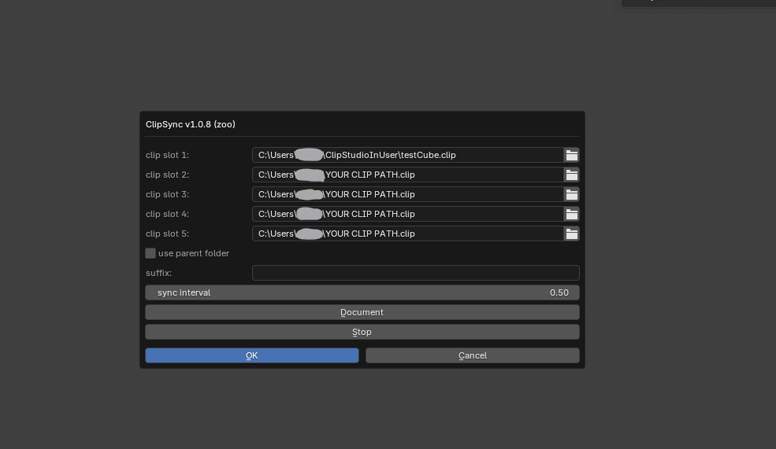

# ClipSync

English:
Synchronize canvas preview image from .clip file to .png file in blender

日本語:
.clipファイルからcanvasのプレビュー画像を.pngファイルに同期するアドオン

## Demo Link (x.com)

https://x.com/arthur484_/status/1846780897724715502

## Download

English:
This is a volunteer project.  If you find it useful, please consider supporting my work by purchasing something from my shop. I would greatly appreciate it, and it will help me continue to improve ClipSync!

日本語:
ボランティア開発のため、あ～さ～のbooth,fanbox見てくれたら、
跳ねて喜びぶよ～! 今後のClipSyncのバージョンアップのモチベーションにするよ!

[Arthur's fan box](https://arthur484.fanbox.cc/)

[Download](https://github.com/arthur-vr/ClipSync/releases)

## How to invoke

English:
- Install the addon
- press F3 and type `clipsync`

日本語:
- アドオンをインストール
- f3を押してclipsyncと検索

## Panel Description

English:
- clip slot 1-5: set the path of the clip under Users/*, only the clip file that exists will be synchronized
- use parent folder: use parent folder or not. If you want to specify a directory other than the directory of the .clip file, set this to true
- parent folder: set the path of the parent folder
- suffix: set the suffix of the file name (example: v2)
- sync interval: set the interval of the sync(seconds)
- Document: open the document in the web browser
- Stop: stop the sync
- OK: save the settings and execute the sync, after that, the sync will be started automatically, .png file will be generated in the same directory as the .clip file, please set the png file as the texture

日本語:
- clip slot 1-5: Users/*以下のclipファイルのパスを設定。存在しているclipファイルのみが同期される
- use parent folder: 親フォルダを使用するかどうか。.clipファイルと同じディレクトリ以外を指定可能
- parent folder: 親フォルダのパスを設定
- suffix: ファイル名の末尾に追加する文字列を設定 (例: v2)
- sync interval: 同期間隔を設定(秒)
- Document: ドキュメントをウェブブラウザで開く
- Stop: 同期を停止
- OK: 同期が開始され、.clipファイルと同じディレクトリに.pngファイルが生成されるので、それをテクスチャとして設定してください

## Differences from AutoSync (frequently asked questions)

English:
- AutoSync can update supported image formats like PNG,PSD, but it doesn't support .clip files.
- AutoSync updates all images, which can be resource-intensive if you have many images. ClipSync only updates the specified image, making it lightweight.
- It intentionally uses only basic Python packages to ensure compatibility with a wide range of Blender versions.
- ClipSync is launched only by f3 search, and does not invade the UI.

日本語:
- AutoSyncはPNG,PSD等の対応画像を更新できるが、.clipファイルは更新できない
- AutoSyncはすべての画像を更新するため、画像が多いと重くなる可能性があるが、ClipSyncでは指定した一つの画像のみが更新されるので軽量である
- あえて、基本的なpythonパッケージのみを使用することで、幅広いバージョンのblenderでも動作するようにしている
- ClipSyncはf3検索からのみ起動され、UIを侵食しない

## Q&A

### English:
#### Image quality is poor when using 4k images
##### This addon is intended to improve the efficiency of texture creation, and the exported texture should be used instead of the preview image.

#### Real-time update is not performed
##### This addon monitors the modification time of the .clip file, so when the modification time of the .clip file changes, the .png file is updated. In the demo video, ctrl+s is set to the button of the liquid tab to reflect it.

### 日本語:
#### 4k画像だと画質が悪くなる
##### あくまでcanvasのプレビュー画像を.pngファイルに変換するだけなので、プレビュー画像の画質の限界が制限になります。 本アドオンでは、質感の確認作業を効率化することを目的としていて、最終的にはプレビュー画像ではなくて、出力したtextureを使用することを想定しています。

#### リアルタイムに更新されない
##### .clipファイルの更新日時を監視しているので、.clipファイルの更新日時が変わると、.pngファイルが更新されます。 デモの動画では、液タブのボタンにctrl+sを設定して、押して反映させています。